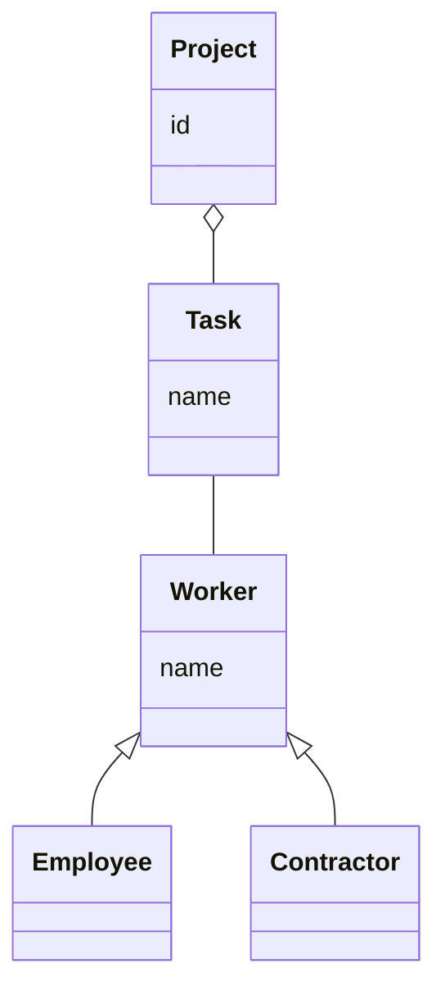

```mermaid
classDiagram
    class Project{
        id
    }
    class Task{
        name
    }
    class Worker{
        name
    }
    Project o-- Task
    Task -- Worker
    Worker <|-- Employee
    Worker <|-- Contractor
```
